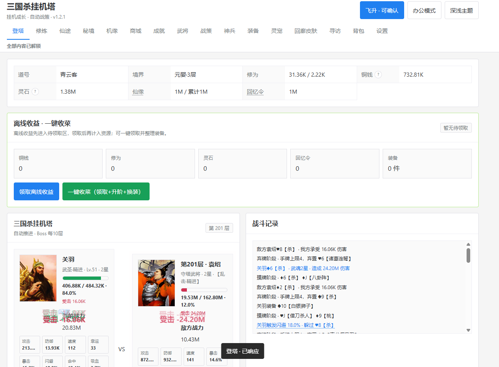

# SanguoshaGuaJiTa
三国杀挂机塔（摸鱼游戏即点即玩）

一款融合 三国杀武将体系、办公室摸鱼、文字挂机、文字游戏、放置养成、魔塔爬层、Roguelike事件、装备Build策略 的单机网页游戏。

在忙碌生活中开启一场轻量化三国冒险，招募三国武将，培养装备、灵宠、功法与神兵，通过自动战斗不断挑战魔塔层数。

游戏采用文字策略与挂机玩法结合的形式，无需长时间操作，即使在碎片时间、休息时间、办公室摸鱼期间，也可以随时查看战斗进度、调整培养方向、收取成长收益。

在数千层魔塔中，玩家将面对随机敌人强化、Boss阶段机制、30种战斗状态、奇遇事件以及多路线成长选择，打造属于自己的最强挂机阵容。

项目采用纯前端离线运行模式，无需服务器部署，支持 PC 浏览器与移动端浏览器运行。

主要功能
⚔️ 武将系统
固定32名三国武将体系
每名武将拥有独立技能机制
支持3～5星成长体系
武将事件技能影响自动战斗策略
支持武将招募与头像展示
🏯 魔塔挂机系统
无限爬塔式挑战玩法
普通层、精英层、Boss层多种战斗结构
敌人拥有随机属性波动
Boss拥有阶段机制与专属战策
支持自动挂机推进

即使暂时离开，也能持续积累成长。

🖥️ 办公室摸鱼模式

专为碎片时间设计：
单页面运行
无需安装客户端
无需服务器登录
浏览器直接打开
自动战斗持续推进
随时查看收益和成长

适合
工作间隙放松
午休娱乐
通勤时间
短时间挂机

用轻量文字玩法体验持续成长乐趣。

📜 文字游戏体验

采用经典文字挂机游戏设计：

自动战斗日志
武将技能触发记录
装备成长反馈
奇遇事件选择
Boss战斗过程展示
成长数值变化

玩家通过阅读战斗过程，体验类似传统文字MUD、挂机修仙、放置游戏的成长反馈。

🎲 奇遇与随机成长
333件机缘事件
29件厄运三选一事件
6件幸运事件

包含：
随机奖励
风险选择
路线记忆
长期成长影响

每一次挂机旅程都有不同的发展方向。

🎒 装备与养成系统
装备品质成长
装备词条强化
灵宠培养
功法搭配
神兵培养

通过不同Build组合形成：
爆发流
生存流
控制流
状态流
持续输出流

技术特点
纯前端离线运行
无服务器依赖
支持PC浏览器
支持移动端浏览器
本地存档体系
响应式移动UI
自动战斗模拟系统
文字日志驱动玩法
适合碎片时间体验
本地运行

直接打开：

三国杀挂机塔_双击运行.html

即可运行。

本项目为个人学习与研究用途项目。

部分美术、音效及参考资料来源于公开网络资源，仅用于非商业展示。

如涉及版权问题，请联系处理。
